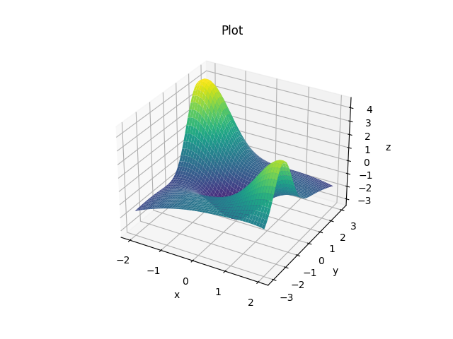

# OMML-HW1

This repository contains the code for the first homework of the *Optimization Methods for Machine Learning* course (1041415), Sapienza University. The group was composed by Nina Kaploukhaya, Mehrdad Hassanzadeh and me.

**TL;DR**: The task involved building two shallow *FNN* architectures entirely from scratch, <ins>without</ins> relying on specific frameworks such as *TensorFlow* or *Pytorch*, and optimizing the loss function using a routine from *scipy.optimize*. 

## Scope 

The scope of this project is reconstructing the two-dimensional function $F:\mathbb{R}^2 \rightarrow \mathbb{R}$ plotted below, whose analytic expression is not given, within a specified region. 

## Data

The data set contains 250 points randomly sampled from the function.

## Models

The two shallow *FNN* are an *MLP*, and an *RBF*. 

## Results 
Everything is explained in the notebook `Calibration.ipynb`
